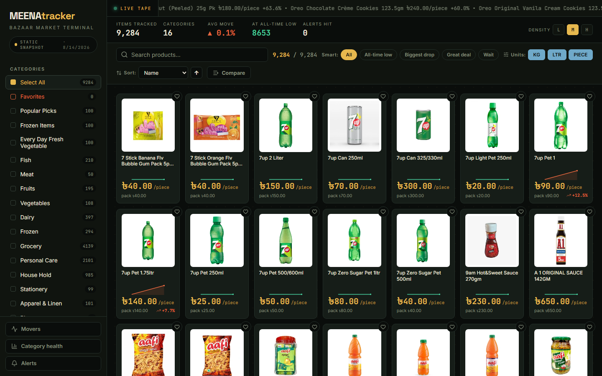

# 🛒 MEENAtracker — Bazaar Market Terminal

> **High-density per-unit price analytics for [Meena Bazar Online](https://meenabazaronline.com) — a god-view grocery market terminal with Playwright ingestion, FastAPI, and a React + TypeScript dashboard. Deploys to GitHub Pages as a fully static site.**

[](https://react.dev/)
[](https://www.typescriptlang.org/)
[](https://fastapi.tiangolo.com/)
[](https://playwright.dev/)
[](https://www.sqlite.org/)
[](https://pages.github.com/)

---

## 🌐 Live demo

The dashboard is published as a static GitHub Pages site — **no backend required**.
Every push to `main` rebuilds and deploys automatically:

**https://ranehal.github.io/MEEnaBAzar-analylics/**

---

## ✨ What's inside

- **📈 SteamDB-style price history graphs** — per-item area charts with 7D / 30D / 90D / 6M / 1Y / ALL ranges, per-unit vs. pack-price toggle, all-time-low marker, average reference line, buy-suggestion pill, stat chips and a recent-history table.
- **📟 Live market tape** — a scrolling ticker of today's biggest movers, exactly like a stock terminal but for groceries.
- **🌡️ Market movers & category health** — biggest drops/gains panels and a per-category average-move heatmap.
- **🔔 Price alerts** — set a target per-unit price; items light up when the price hits it (persisted in localStorage).
- **⚡ Sparklines on every card** — mini price-trend curves at a glance.
- **🗂️ Compare up to 5 items** on a single color-coded line chart with range selection.
- **🎚️ Density control** — comfortable / compact / dense grid modes.
- **🔍 Smart filters** — all-time low, biggest drop, great deal, wait; plus search, unit filters, favorites and sorting.
- **🔌 Dual data mode** — live FastAPI when reachable, otherwise a self-contained static snapshot.

---

## 🏗️ Architecture

```mermaid
flowchart TD
    subgraph Ingestion ["⚡ Ingestion (backend/)"]
        PW[Playwright headless crawler] -->|renders Angular SPA| MB[meenabazaronline.com]
        PW -->|products + prices| DB[(SQLite meenatracker.db)]
        EXP[export_db.py] -->|snapshot| JSON[frontend/public/data/meenatracker.json]
        DB --> EXP
    end
    subgraph API ["🖥️ FastAPI (backend/)"]
        DB --> API[products · categories · history]
    end
    subgraph UI ["📊 Dashboard (frontend/)"]
        React[React 19 + TS] -->|live mode| API
        React -->|static mode| JSON
        React --> Grid[Market terminal UI]
    end
```

- `backend/scraper.py` — parallelized Playwright crawler (4 concurrent pages) that walks every
  category, solves the delivery-area modal, and stores per-unit prices into SQLite.
- `backend/main.py` — FastAPI endpoints: `/products`, `/categories`, `/products/{id}/history`,
  `/products/{id}/favorite`.
- `backend/database.py` — SQLAlchemy models: `Category`, `Product`, `PriceHistory`
  (~377k history rows in production).
- `backend/export_db.py` — dumps the DB into the compact `meenatracker.json` snapshot that powers
  the static GitHub Pages demo.
- `frontend/src` — the market-terminal UI (`App.tsx` + components for ticker, movers, heatmap,
  watchlist, sparkline, item/compare modals).

---

## 🚀 Local setup

```bash
# Backend + scraper
cd backend
pip install -r requirements.txt
playwright install chromium
python scraper.py                 # crawl and store prices
uvicorn main:app --reload --port 8000

# Frontend (uses live API; falls back to the static snapshot otherwise)
cd ../frontend
npm install
npm run dev                       # http://localhost:5173
```

Or just run `run_all.bat` on Windows to launch both.

### Refresh the static snapshot

After a scrape, regenerate the GitHub Pages data:

```bash
cd backend && python export_db.py
```

---

## 🗂️ Repository structure

```
MEENAtracker/
├── .github/workflows/deploy.yml  # builds dist/ and publishes to gh-pages
├── backend/
│   ├── scraper.py               # Playwright crawler
│   ├── main.py                  # FastAPI REST endpoints
│   ├── database.py              # SQLAlchemy models
│   ├── export_db.py             # static snapshot exporter
│   └── meenatracker.db          # SQLite database
└── frontend/
    ├── public/data/meenatracker.json  # static snapshot (GitHub Pages)
    └── src/                     # React dashboard
```

---

## 📜 License

MIT. Data rights belong to Meena Bazar; built for personal tracking and analytical research.


---

## 📸 Screenshots



---

## 🚀 Future Work & Industrial Roadmap

To elevate this platform to an enterprise-grade, production-ready product meeting current industrial standards, the following strategic goals and architecture enhancements are planned:

### 1. 🏗️ High-Availability Microservices & Infrastructure
- **Containerization & Orchestration**: Package ingestion workers, APIs, and dashboards into Docker containers with deployment via **Kubernetes (K8s)** and Helm charts for autoscaling during peak traffic hours.
- **Distributed Ingestion Workers**: Transition from localized scraping scripts to an asynchronous, fault-tolerant worker pool utilizing **Celery + Redis** or **Temporal.io** with automated proxy rotation, rate-limiting retry strategies, and CAPTCHA bypass capabilities.
- **High-Performance API Gateway**: Implement an enterprise API Gateway (Kong / Envoy) providing OAuth2 / JWT authentication, TLS termination, and granular rate limiting (Token Bucket algorithm).

### 2. 📊 Enterprise Data Engineering & Streaming Pipelines
- **Data Lakehouse Architecture**: Store multi-year raw price histories using **Apache Parquet / Delta Lake** or **Google BigQuery** for scalable analytical queries across millions of SKU updates.
- **Real-Time CDC & Message Streaming**: Integrate **Apache Kafka** or **NATS** for Change Data Capture (CDC) to stream price change events instantly to downstream analytics and notification consumers.
- **Automated Workflow Orchestration**: Schedule and monitor data ingestion, ETL pipelines, and unit normalization using **Apache Airflow** or **Prefect** integrated with **dbt** for dynamic data transformations.

### 3. 🧠 Machine Learning & Advanced Market Intelligence
- **Predictive Price Forecasting**: Deploy **Prophet** and **LSTM Neural Networks** to predict future price drops, historical promotion trends, and seasonal discount cycles.
- **Anomaly & Surge Detection**: Build ML models to identify artificial price hikes before promotional sales, mislabeled unit metrics, and phantom stock availability.
- **Semantic Product Entity Matching**: Utilize vector embeddings (OpenAI / Sentence-Transformers) paired with **pgvector** / **Pinecone** to match identical SKUs across competitor platforms despite variations in naming formats.

### 4. 🔐 Security, Compliance & System Observability
- **Zero-Trust Security & RBAC**: Enforce Role-Based Access Control (RBAC), AES-256 GCM payload encryption at rest, and secret rotation via HashiCorp Vault.
- **Full Observability Stack**: Instrument services with **OpenTelemetry**, emitting distributed traces, Prometheus metrics, and structured logs to **Grafana Loki & Tempo** dashboards.
- **SLA Alerting & Webhook Engine**: Provide instant trigger notifications via **Telegram Bot API**, **Discord Webhooks**, email notifications, and enterprise SMS gateways when watched items reach target prices.

### 5. 📱 Next-Gen User Experience & Mobile Platforms
- **Cross-Platform Mobile App**: Develop a dedicated **React Native / Flutter** app featuring push notifications for price drops, barcode scanning in physical stores, and personalized deal watchlists.
- **Progressive Web App (PWA)**: Upgrade the dashboard to a full PWA with offline caching via Service Workers, dynamic theme switching, and desktop application installability.
