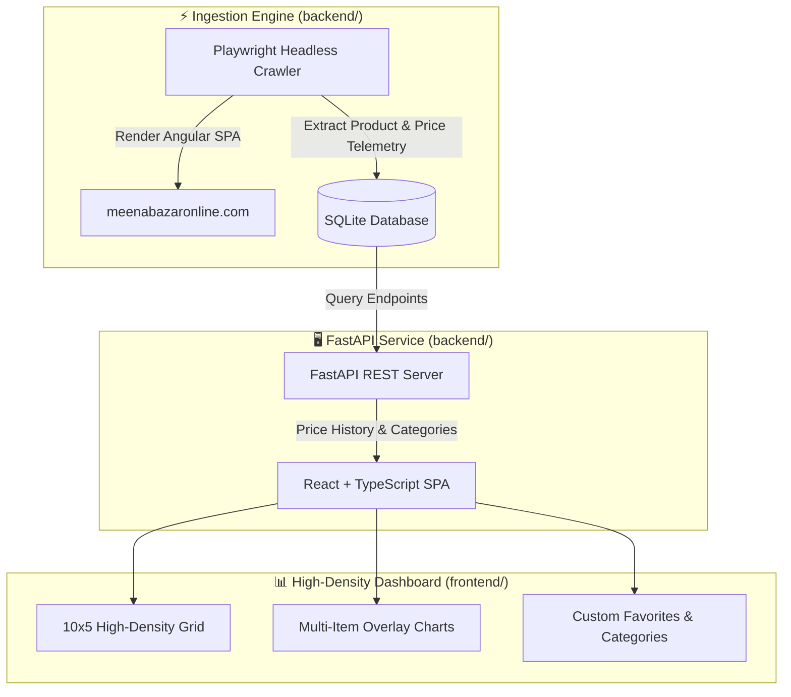

# 🛒 MEENAtracker — High-Density Supermarket Price Tracker

> **Pro-Developer "God-View" Telemetry, Unit-Price Analytics & Headless Playwright Ingestion Suite for Meena Bazar Online.**

[](https://react.dev/)
[](https://www.typescriptlang.org/)
[](https://fastapi.tiangolo.com/)
[](https://playwright.dev/)
[](https://www.sqlite.org/)
[](LICENSE)

---

## 📌 Executive Summary

**MEENAtracker** is a high-density, "god-view" grocery price tracker and market analytics platform engineered specifically for [Meena Bazar Online](https://meenabazaronline.com), one of Bangladesh's retail supermarket chains.

Built using **Playwright** to navigate Meena Bazar's Angular SPA client rendering, **FastAPI** as a backend service, and **React + TypeScript** for a 10x5 compact grid dashboard, MEENAtracker provides deep per-unit price analytics (`৳/kg`, `৳/ltr`, `৳/pc`), multi-item chart comparisons, and customizable user categories.

---

## 🚀 Key Features

- **🌐 Playwright Headless Angular Crawler**: Seamlessly executes client-side JavaScript to extract Angular SPA product listings without triggering anti-bot protections.
- **🖥️ 10x5 High-Density "God-View" Grid**: Optimized UI/UX delivering maximum information density, displaying bold per-unit prices (`৳/kg`) alongside actual unit prices.
- **📈 Multi-Item Chart Comparison**: Overlay multiple product price trends on a single color-coded chart with custom mean date range selection.
- **⭐ Custom Categories & Favorites**: Create user-defined category views and star favorite items saved locally.
- **🔍 Granular Sorting & Filtering**: Multi-select filters for `kg`, `ltr`, `piece`, combined with sorting by per-unit price, actual price, or item name.

---

## 🏗️ System Architecture



---

## 📁 Repository Structure

```
MEENAtracker/
├── MEENAtracker.md           # Core tracking specification & documentation
├── run_all.bat               # Windows batch launcher (Backend, Scraper & Frontend)
├── backend/                  # FastAPI Backend & Scraper Engine
│   ├── main.py               # FastAPI REST endpoints
│   ├── scraper.py            # Playwright headless browser crawler
│   ├── models.py             # Database models & Pydantic schemas
│   └── database.py           # SQLite connection & transaction management
└── frontend/                 # React + TypeScript Frontend Application
    ├── src/
    │   ├── components/       # Grid cards, chart overlays, filter toolbars
    │   ├── App.tsx           # Main Dashboard application entry
    │   └── styles/           # High-density custom CSS variables
    ├── package.json          # Node.js dependencies
    └── tsconfig.json         # TypeScript compiler configuration
```

---

## 🛠️ Usage & Local Setup

### 1. Automated Windows Launcher
Run [`run_all.bat`](file:///C:/PROJECTS/MEENAtracker/run_all.bat) to launch the backend server, database, and frontend UI concurrently:
```cmd
run_all.bat
```

### 2. Manual CLI Setup

#### Backend & Scraper:
```bash
cd backend
pip install -r requirements.txt
playwright install chromium
python scraper.py    # Execute Playwright crawler
uvicorn main:app --reload --port 8000
```

#### Frontend Dashboard:
```bash
cd frontend
npm install
npm run dev
```
Open `http://localhost:5173` in your web browser.

---

## 📜 License

Distributed under the MIT License. Data rights belong to Meena Bazar. Built for personal tracking and analytical research.
